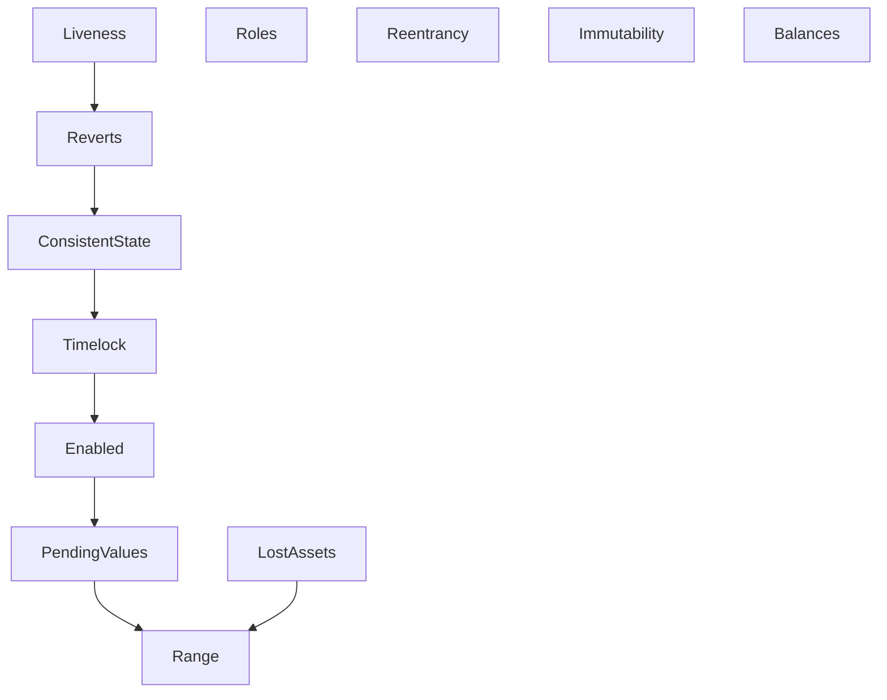

This folder contains the verification of EulerEarn using the Certora Prover.

The verification was inspired by the previous verification projects for Metamorpho and SiloVault (see https://github.com/morpho-org/metamorpho/tree/main/certora)

## Getting started

The code is compiled using 2 versions of solidity, which must be installed to run the verification as:

- `solc-0.8.17` for solidity compiler version 0.8.17 which is used for compiling Permit2
- `solc-0.8.19` for solidity compiler version 0.8.26 which is used for compiling the rest of the solidity files.

Follow Certora installation instructions: https://docs.certora.com/en/latest/docs/user-guide/install.html and the repository build installation for EulerEarn.

## Folders and file structure

The [`certora/specs`](specs) folder contains the following files:

- [`ConsistentState.spec`](specs/ConsistentState.spec) checks various properties specifying what is the consistent state of EulerEarn, what are the reachable setting configurations (such as caps and fee).
- [`Balances.spec`](specs/Balances.spec) checks that tokens are not kept on the EulerEarn contract. Any deposit ends up in the underlying vaults and any withdrawal is forwarded to the user.
- [`Enabled.spec`](specs/Enabled.spec) checks properties about enabled flag of market, notably that it correctly tracks the fact that the market is in the withdraw queue.
- [`Immutability.spec`](specs/Immutability.spec) checks that EulerEarn is immutable.
- [`Liveness.spec`](specs/Liveness.spec) checks some liveness properties of EulerEarn, notably that some emergency procedures are always available.
- [`PendingValues.spec`](specs/PendingValues.spec) checks properties on the values that are still under timelock. Those properties are notably useful to prove that actual storage variables, when set to the pending value, use a consistent value.
- [`Range.spec`](specs/Range.spec) checks the bounds (if any) of storage variables.
- [`Reentrancy.spec`](specs/Reentrancy.spec) checks that EulerEarn is reentrancy safe by making sure that there are no untrusted external calls.
- [`Reverts.spec`](specs/Reverts.spec) checks the revert conditions on entrypoints.
- [`Roles.spec`](specs/Roles.spec) checks the access control and authorization granted by the respective EulerEarn roles. In particular it checks the hierarchy of roles.
- [`Timelock.spec`](specs/Timelock.spec) verifies computations for periods during which we know the values are under timelock.

The [`certora/specs/summaries`](specs/summaries) folder contains summaries for different functions that simplify the behavior of different functions, namely mathematical functions in [`Math.spec`], and dispatching summaries that allow the prover to recognize the appropriate function to resolve to when we have external calls to underlying vaults.

The [`certora/confs`](confs) folder contains a configuration file for each corresponding specification file.

The [`certora/harnesses`](harnesses) folder contains harness contracts that enable the verification of EulerEarn, by exposing internal functions and fields. 

The [`certora/mocks`](mocks) folder contains mock contracts that simplify the verification of EulerEarn, by fixing reference implementations for the underlying token and vaults. 

The [`certora/scripts`](mocks) folder contains a patch that applies a simple modification to the EulerEarn contract that introduces ghost variables that simplify verification, and the `PatchAndCertoraRun.sh` script that is used to run rules after the patch is applied.

The [`certora/gambit`](gambit) folder contains mutation testing - modified versions of the EulerEarn contract that have been injected with bugs and configuration files to run different rules on EulerEarn and the mutations to show that these bugs can be found by the given rules.

## Specification imports graph

Most rules follow the same setup starting with `Range.spec`, with the exception of Roles, Reentrancy, Immutability, Balances, and MarketInteractions that require a different setup with non-standard summaries that have assertions or modifications to rule-specific flags.  

